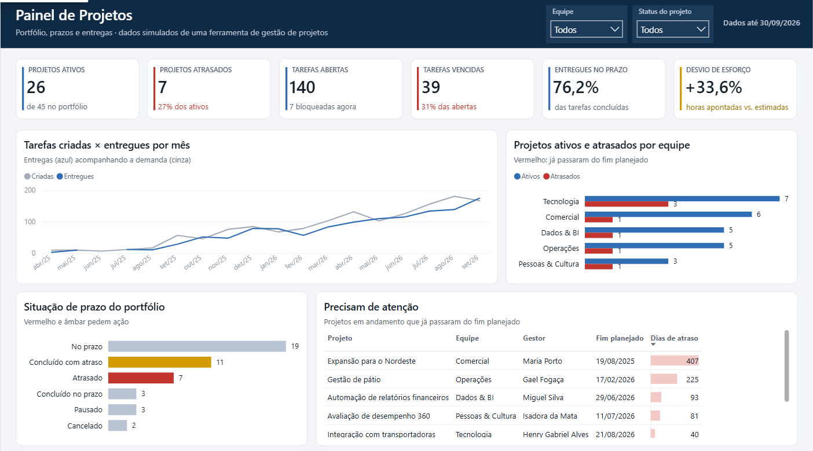
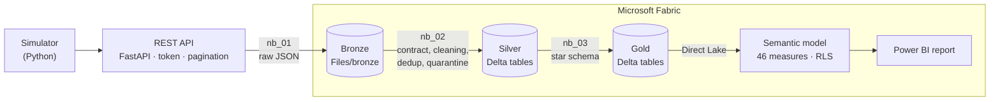

# Project Dashboard · API + Microsoft Fabric + Power BI

[Versão em português](README.md)

> **Every manager knows how many projects they have. Few know, without opening ten screens, which ones are late, where tasks get stuck and how much of the hour budget is already gone.**

This project pulls data from a project-management tool **through an API**, processes it in **Microsoft Fabric** in layers (bronze, silver and gold) and delivers a **Direct Lake semantic model** with 46 measures, a **4-page Power BI report** and **row-level security per team**, all published from code.

It follows the [Ideas Dashboard](https://github.com/GuilhermeRostirolla/painel-ideias-powerbi): there the data was born in a SQL Server database; here it comes from an API, as with Jira, Asana or ClickUp, so the pipeline has to handle everything a real API does: tokens, pagination, incremental loads and rate limiting.

### Questions the dashboard answers

- **Portfolio:** how many projects are in progress, paused, cancelled or done, by team and manager.
- **Deadlines:** which projects are past their planned end date, how many tasks are overdue and by how much.
- **Flow:** how long tasks stay in each stage, where they get blocked and how often they come back from review.
- **Delivery:** lead time (creation to done) and cycle time (start of work to done).
- **Effort:** estimated × logged hours, budget overrun per project, workload per person.

### The simulated scenario

- **45 projects** from **5 teams**, **59 people**, **1,435 tasks** and **7,633 status changes**, Jan/2025 to Sep/2026.
- Each task moves **Backlog → To Do → In Progress → In Review → Done**, and may be **blocked**, **sent back for rework** or **cancelled**.
- On the reference date (2026-09-30): 25 projects in progress (**7 already late**), 14 done, 1 planning, 3 paused, 2 cancelled; **39 overdue tasks** and effort **34% above estimate**.

### Why the data is fictitious

Project and people-performance data is **sensitive**. Instead of pointing at a real tool, I built a **simulated API** that behaves like one: it requires a token, paginates, accepts an incremental filter and occasionally answers "too many requests" to prove the ingestion knows how to wait and retry.

Behind it is a **Python simulator** that does not draw random numbers: each task lives its journey as a **state machine**, with variable time per stage, blocks, rework and cancellations. It looks like real data with **no real data** inside.

## Architecture

| Layer | What it does |
|---|---|
| **Simulator** (`simulador/`) | Generates teams, people, projects, tasks and status history as a state machine, and validates consistency before serving. |
| **API** (`api/`) | FastAPI with token auth, pagination, `atualizado_desde` incremental filter and occasional 429s. |
| **Bronze** (`nb_01`) | Stores each API page exactly as received, with a watermark for incremental loads. |
| **Silver** (`nb_02`) | Applies a data contract, standardizes text and dates, keeps one row per record and quarantines rule breakers. |
| **Gold** (`nb_03`) | Star schema for Direct Lake, with self-checks before finishing. |
| **Semantic model** | Direct Lake, 7 tables, 7 relationships, 46 measures and one security role per team, generated as TMDL by `tools/gerar_modelo.py`. |
| **Report** | 4 PBIR pages (Overview, Projects, Flow & bottlenecks, People & effort), generated by `tools/gerar_relatorio.py`. |
| **Publishing** (`nb_04`) | Creates the model and report through the Fabric REST API, then checks every measure and every security role. |

## How I know it works

- **It ran in Fabric for real**: bronze → silver → gold in Delta; the model and report were published, and **all 46 measures, computed in DAX inside Fabric, matched an independent SQL calculation**.
- **Row-level security is tested, not assumed**: `nb_04` queries the model as each team role and compares what it sees with per-team counts computed in SQL.
- **Incremental load = full load**: a full load on Aug 31 plus an incremental load on Sep 30 (with 30% of calls failing on purpose) produced a gold layer identical, row by row, to a direct full load on Sep 30.
- **Designed before coded**: the first report worked but looked generic. I wrote a 10-point design review, drew the redesign in Figma ([`docs/design/`](docs/design/)) and then rewrote the generator: dark header with filters, KPI cards with a context line and a status bar, one meaning per color (palette checked for color blindness), horizontal bars and data bars in tables.
- **270+ automated tests**: simulator, API, notebooks, semantic model (every column and measure referenced in DAX exists), report (every field exists, no visual overlaps) and the full pipeline on local Spark.

## Running it

- **Locally:** `pip install -r requirements-dev.txt`, then `pytest` and `python tools/rodar_local.py --limpar` (runs the Fabric notebooks unchanged on local Spark).
- **In Fabric:** create a workspace and a lakehouse named `lh_projetos`, then in any notebook run
  `import requests; exec(requests.get("https://raw.githubusercontent.com/GuilhermeRostirolla/painel-projetos-fabric/main/tools/instalar_no_fabric.py").text)`
  to install the notebooks. Run `tools/testar_no_fabric.py` the same way (it starts the simulated API inside the session and runs the pipeline), then run `nb_04_publicar_modelo` to publish and verify the model and report.

Details, design decisions and lessons from the real Fabric run are in the [Portuguese README](README.md).

## How it was built

Built by me with AI assistance (Claude) as a programming assistant. The idea, process design, business rules, metrics and review of every deliverable are mine; the AI sped up code writing, tests and checks.
