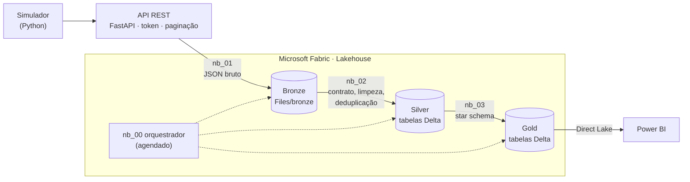

# Painel de Projetos · API + Microsoft Fabric + Power BI

> **Todo gestor sabe quantos projetos tem. Poucos sabem, sem abrir dez telas, quais estão atrasados, onde as tarefas travam e quanto do orçamento de horas já foi.**

Este projeto busca os dados de uma ferramenta de gestão de projetos **por API**, trata tudo no **Microsoft Fabric** em camadas (bronze, silver e gold) e entrega um modelo pronto para um painel no **Power BI em Direct Lake**.

É a continuação do [Painel de Ideias](https://github.com/GuilhermeRostirolla/painel-ideias-powerbi): lá o dado nascia num banco SQL Server; aqui ele vem de uma API, como acontece com Jira, Asana, ClickUp e companhia, e o pipeline precisa lidar com tudo que uma API real faz: token, paginação, carga incremental e limite de requisições.

### Perguntas que o painel vai responder

- **Portfólio:** quantos projetos estão em andamento, pausados, cancelados e concluídos, por equipe e gestor.
- **Prazo:** quais projetos passaram do fim planejado, quantas tarefas estão vencidas e quanto cada uma atrasou.
- **Fluxo:** quanto tempo as tarefas ficam em cada etapa, onde travam (bloqueios) e quanto voltam da revisão (retrabalho).
- **Entrega:** lead time (da criação à conclusão) e tempo de ciclo (do início do trabalho à conclusão), por tipo de tarefa.
- **Esforço:** horas estimadas × apontadas, estouro de orçamento por projeto, carga por pessoa.

### O cenário simulado

- **45 projetos** de **5 equipes** (Tecnologia, Dados & BI, Operações, Comercial e Pessoas & Cultura), **59 pessoas**, **~1.400 tarefas** e **~7.500 mudanças de status**, de jan/2025 a set/2026.
- Cada tarefa percorre **Backlog → A Fazer → Em Andamento → Em Revisão → Concluída**, podendo ser **bloqueada**, **voltar para retrabalho** ou ser **cancelada**.
- Na data de referência (30/09/2026): 20 projetos em andamento, 14 concluídos, 5 em planejamento, 3 pausados e 3 cancelados. Cerca de 20% das tarefas concluídas atrasaram, e projetos com "saúde" ruim ganham escopo no caminho e estouram prazo e orçamento.

### Por que os dados são fictícios

Dados de projetos e de desempenho de pessoas são **informações sensíveis**. Por isso, em vez de apontar para uma ferramenta real, criei uma **API simulada** que se comporta como uma: exige token, pagina os resultados, aceita filtro incremental e, de vez em quando, responde "muitas requisições" para provar que a ingestão sabe esperar e tentar de novo.

Por trás da API há um **simulador em Python** que não sorteia números soltos: cada tarefa vive a jornada como uma **máquina de estados**, com tempos variáveis em cada etapa, bloqueios, retrabalho e cancelamentos. O resultado tem cara de dado real e **nenhum dado real** dentro.

## Arquitetura



| Camada | O que faz |
|---|---|
| **Simulador** (`simulador/`) | Gera equipes, pessoas, projetos, tarefas e o histórico de status como uma máquina de estados. Valida a coerência de tudo antes de servir. |
| **API** (`api/`) | FastAPI com token, paginação, filtro `atualizado_desde` e respostas 429 ocasionais. Publicada no Render (gratuito) para o Fabric conseguir chamar. |
| **Bronze** (`nb_01`) | Grava cada página da API exatamente como chegou, em JSON, com controle de marca d'água para a carga incremental. |
| **Silver** (`nb_02`) | Aplica o contrato de dados (schema fixo por recurso), padroniza textos e datas, deixa uma linha por registro e manda o que quebra regra para a quarentena. |
| **Gold** (`nb_03`) | Star schema para Direct Lake: `fato_tarefa`, `fato_passagem_status`, `dim_projeto`, `dim_pessoa`, `dim_status`, `dim_data` e `ref_parametros`. Confere as próprias contas antes de terminar. |
| **Orquestrador** (`nb_00`) | Roda as três etapas em sequência. É ele que fica agendado. |

## Decisões que tomei

| Decisão | Por quê |
|---|---|
| **Bronze guarda o JSON bruto, sem tratar** | Se uma regra da silver mudar, reprocesso tudo a partir do bronze sem chamar a API de novo. E sempre dá para ver exatamente o que a fonte mandou. |
| **Carga incremental com marca d'água e sobreposição** | Cada execução pede só o que mudou desde a última. Relê 5 minutos antes da marca para não perder nada na fronteira; os duplicados que isso gera são removidos na silver. |
| **Marca d'água só avança no fim** | Se a ingestão cair no meio, a próxima execução repete a janela inteira. Melhor buscar duas vezes do que perder dado. |
| **Novas tentativas com espera** | 429, erro 5xx e queda de conexão não derrubam a carga: o notebook respeita o `Retry-After` e tenta de novo com espera crescente. |
| **Token no Azure Key Vault** | O token nunca aparece no notebook nem no Git. O notebook lê o segredo em tempo de execução. |
| **Contrato de dados na silver** | Cada recurso tem um schema fixo. Se a API mudar um campo, o erro aparece no pipeline, não como número estranho no painel. |
| **Quarentena em vez de descarte** | Registro com status desconhecido, chave órfã ou horas negativas vai para `silver_rejeitados` com o motivo. Nada some sem rastro. |
| **Silver reconstruída a partir do bronze inteiro** | Neste volume é barato, e a silver fica sem estado: rodar duas vezes dá o mesmo resultado. Se o volume crescer, troco por `MERGE` incremental. |
| **Métricas de tempo calculadas do histórico de status** | Ciclo, dias bloqueada e retrabalho saem dos eventos, não de campos prontos da API. Assim batem entre si e com o fluxo mostrado no painel. |
| **Data de referência gravada nos dados** | Atraso, idade e "vencida" são medidos contra a data de referência, não contra `TODAY()`. O painel não muda sozinho de um dia para o outro e qualquer pessoa reproduz os mesmos números. |
| **Horário de Brasília na gold** | A API manda as datas com fuso; a silver guarda o instante em UTC e a gold converte para o horário de Brasília, que é o que o usuário espera ver. |
| **Simulador com "relógio"** | O mundo é simulado uma vez e a data de referência só corta a história. Subir a API em 31/08 e depois em 30/09 equivale a um sistema real que andou um mês. Foi isso que me permitiu provar a carga incremental. |
| **Notebooks no formato Git do Fabric** | A pasta `fabric/` sincroniza direto com um workspace pela integração com Git: os notebooks são texto, versionados e revisáveis linha a linha. |

## Como sei que funciona

- **49 testes automatizados**: simulador (coerência, determinismo, calibração), API (token, paginação, incremental, 429), notebooks (formato, sintaxe) e o pipeline inteiro rodando com Spark.
- **A gold é conferida contra contas feitas à mão**: status, situação de prazo, retrabalho, bloqueios, horas e projetos atrasados são recalculados em Python puro a partir da API e precisam bater com o que o Spark produziu.
- **Carga incremental = carga completa**: rodei uma carga completa com os dados de 31/08, depois uma incremental com os de 30/09 (com 30% das chamadas falhando de propósito) e comparei a gold, linha a linha, com uma carga completa direta de 30/09. Todas as tabelas ficaram idênticas.
- **A própria gold se confere**: antes de terminar, o `nb_03` verifica chaves, uma etapa atual por tarefa, tempos não negativos e cobertura do calendário. Se algo não fechar, a execução falha.

## Como rodar

### 1. Na sua máquina (sem Fabric)

Precisa de Python 3.11+ e, para o pipeline, Java 17+.

```bash
python -m venv .venv && source .venv/bin/activate      # Windows: .venv\Scripts\activate
pip install -r requirements-dev.txt

pytest                                   # testes rápidos
pytest -m pipeline                       # pipeline completo com Spark (~1 min)

uvicorn api.app:criar_app --factory      # API em http://127.0.0.1:8000/docs (token: token-demo)
python tools/rodar_local.py --limpar     # roda os notebooks do Fabric localmente
```

O `rodar_local.py` executa os notebooks **exatamente como estão** na pasta `fabric/`; só troca os caminhos do lakehouse e grava em Parquet, porque o Delta exige bibliotecas que o Fabric já traz.

### 2. Publicar a API

O Fabric precisa de uma URL pública. O jeito mais simples é o [Render](https://render.com) (plano gratuito):

1. **New → Blueprint** e aponte para este repositório. O `render.yaml` já configura tudo.
2. Em **Environment**, copie o valor de `API_TOKEN` que o Render gerou.
3. Teste: `https://<seu-app>.onrender.com/docs`.

> No plano gratuito a API dorme sem uso e leva cerca de 1 minuto para acordar. A ingestão já espera por isso.

### 3. Guardar o token no Key Vault

Crie um Azure Key Vault (ou use um existente), adicione o segredo `token-api-projetos` com o token do Render e dê à sua conta permissão de leitura de segredos.

### 4. Montar no Fabric

1. Crie um workspace e um **Lakehouse** (sugestão: `lh_projetos`).
2. Traga os notebooks de um destes jeitos:
   - **Integração com Git** (recomendado): Configurações do workspace → Integração com Git → conecte este repositório com a pasta `fabric`.
   - **Importar**: Workspace → Importar → Notebook → os arquivos de `fabric/ipynb/`.
3. Em **cada** notebook, adicione o `lh_projetos` como **lakehouse padrão** (painel Explorer → Lakehouses).
4. Abra o `nb_00_orquestrador`, preencha `URL_API` e `KEY_VAULT_URL`, troque `MODO` para `completo` e rode.
5. Volte `MODO` para `incremental` e **agende** o `nb_00` (ex.: todo dia às 6h).

Ao final, o lakehouse terá as tabelas `silver_*` e o star schema da gold, prontos para o modelo semântico.

## Estrutura

```
api/                    API FastAPI
simulador/              simulador: catálogos, máquina de estados, cenário e validação
fabric/
  nb_00_orquestrador.Notebook/
  nb_01_bronze_ingestao.Notebook/
  nb_02_silver_tratamento.Notebook/
  nb_03_gold_modelo.Notebook/
  ipynb/                os mesmos notebooks em .ipynb, para importação manual
tools/
  rodar_local.py        roda os notebooks com Spark local
  comparar_gold.py      compara duas golds linha a linha
  exportar_ipynb.py     gera fabric/ipynb a partir dos notebooks
tests/
Dockerfile, render.yaml publicação da API
```

## Próximos passos

- [x] Simulador, API, ingestão e camadas bronze, silver e gold
- [ ] Modelo semântico em **Direct Lake** com as medidas (projeto PBIP versionado, como no Painel de Ideias)
- [ ] Relatório: portfólio, prazos, fluxo e gargalos, esforço e pessoas
- [ ] Segurança por linha por equipe

## Como foi construído

Projeto desenvolvido por mim com apoio de IA (Claude) como assistente de programação. A ideia, o desenho das camadas, as regras de negócio, as métricas e a revisão de cada entrega são meus; a IA acelerou a escrita de código, os testes e as verificações.
