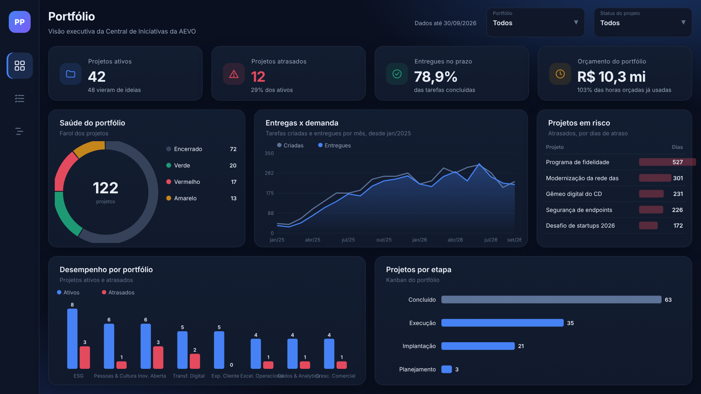
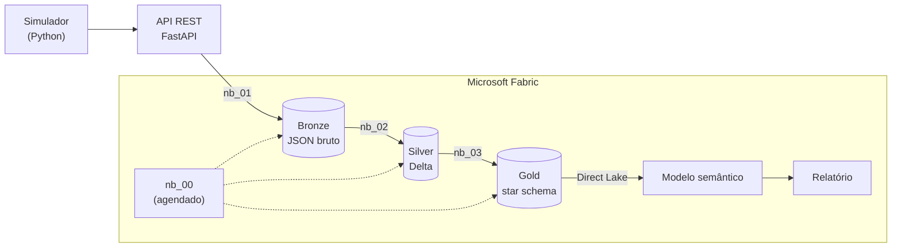
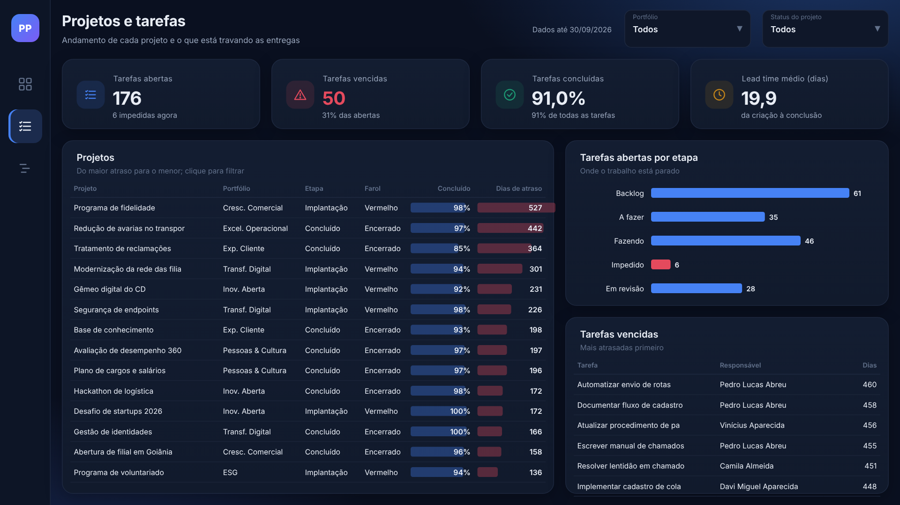
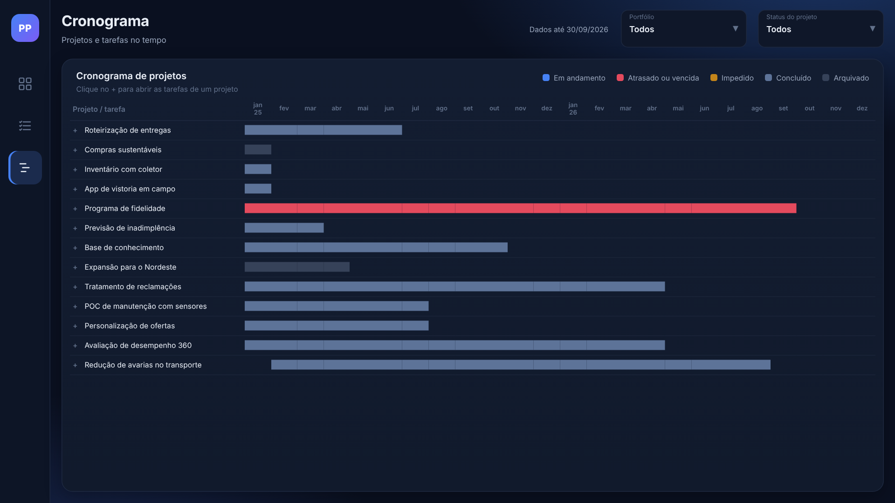

# Painel de Projetos - API + Microsoft Fabric + Power BI

Pipeline que busca dados de uma ferramenta de gestão de projetos por API, trata no Microsoft Fabric (bronze, silver e gold) e entrega um modelo semântico em Direct Lake com um relatório executivo de 3 páginas no Power BI. Modelo e relatório são gerados por código e publicados por notebook.

É a continuação do [Painel de Ideias](https://github.com/GuilhermeRostirolla/painel-ideias-powerbi). Lá o dado vinha de um SQL Server; aqui vem de uma API no formato da Central de Iniciativas da AEVO (portfólios, projetos, tarefas e movimentações), então a ingestão precisa lidar com token, paginação, carga incremental e limite de requisições.



## O que o painel responde

- Como está a saúde do portfólio (farol verde, amarelo, vermelho) e em que etapa estão os projetos
- Quais projetos estão atrasados, quanto e de qual portfólio são
- Quanto do orçamento já foi consumido e quantos projetos vieram de ideias
- Quantas tarefas estão vencidas ou impedidas e quanto tempo levam do início ao fim
- Como projetos e tarefas se distribuem no tempo (Gantt)

## Dados

Os dados são fictícios: informação de projeto e de desempenho de pessoas é sensível, então montei uma API simulada que se comporta como a de uma ferramenta real (token, paginação, filtro incremental e respostas 429 de vez em quando).

Os campos seguem a Central de Iniciativas da AEVO: projetos com etapa do portfólio (Planejamento, Execução, Implantação, Concluído), situação (Ativo, Concluído, Arquivado), farol, origem (Ideia, Startup ou direto), gerente, orçamento e etiquetas como "Em espera"; tarefas no kanban Backlog, A fazer, Fazendo, Impedido, Em revisão, Concluído e Arquivada.

Por trás da API tem um simulador em Python em que cada tarefa passa por essa máquina de estados, com impedimentos, retrabalho e arquivamentos. Cada projeto tem uma "saúde" e um prazo que o gerente prometeu, às vezes otimista demais.

Cenário em 30/09/2026: 8 portfólios, 122 projetos, 147 pessoas, 4.467 tarefas e 24.424 movimentações desde jan/2024. 42 projetos ativos, 12 atrasados, 50 tarefas vencidas, R$ 10,3 mi de orçamento e 48 projetos nascidos de ideias.

## Arquitetura



- **Bronze (`nb_01`)**: grava cada página da API como veio, com marca d'água por recurso. A marca só avança se todos os recursos forem gravados, então uma falha no meio faz a próxima execução repetir a janela. 429 e 5xx têm nova tentativa respeitando o `Retry-After`. O token fica no Key Vault.
- **Silver (`nb_02`)**: schema fixo por recurso, textos e datas padronizados, uma linha por registro. Registro com status desconhecido ou chave órfã vai para `silver_rejeitados` com o motivo.
- **Gold (`nb_03`)**: `fato_tarefa`, `fato_passagem_status` e as dimensões. Ciclo, tempo impedido e retrabalho saem do histórico de movimentações. Tudo é medido contra a data de referência gravada nos dados, não contra `TODAY()`, para os números não mudarem sozinhos.
- **Modelo (`PainelProjetos.SemanticModel`)**: Direct Lake, 7 tabelas, 53 medidas e um papel de RLS por portfólio (8). O TMDL é gerado por `tools/gerar_modelo.py` a partir do schema da gold.
- **Relatório (`PainelProjetos.Report`)**: PBIR gerado por `tools/gerar_relatorio.py`, sobre fundos desenhados em HTML (`tools/design`).
- **Publicação (`nb_04`)**: cria ou atualiza modelo e relatório pela API REST do Fabric, roda as medidas em DAX e compara com valores calculados em SQL (`docs/valores_esperados.json`), e consulta o modelo como cada papel de RLS para conferir o filtro.

## Páginas

- **Portfólio**: visão executiva com farol, entregas x demanda, projetos em risco, desempenho por portfólio e kanban de etapas.
- **Projetos e tarefas**: andamento de cada projeto e onde as tarefas estão paradas.
- **Cronograma**: Gantt de projetos que abre nas tarefas, colorido por situação.

| Projetos e tarefas | Cronograma |
|---|---|
|  |  |

## Design

O relatório é pensado para diretoria: tema escuro, quatro indicadores por página com uma linha de contexto ("29% dos ativos", "103% das horas orçadas já usadas"), cor só com significado (azul para volume, vermelho para atraso, âmbar para impedimento, verde para prazo cumprido) e navegação lateral entre as três páginas.

Os cartões, ícones e a grade ficam numa imagem de fundo por página, gerada de um HTML (`tools/design/mockup_redesign.py` e `renderizar_fundos.js`). Os visuais do Power BI são transparentes e posicionados pela mesma grade (`tools/design/layout.py`), então mockup e relatório não se desalinham. O mockup completo está em [`docs/design/redesign.html`](docs/design/redesign.html).

## Testes

- `pytest`: simulador, API, notebooks, modelo (toda coluna e medida citada no DAX existe) e relatório (todo campo existe, nenhum visual sobreposto).
- `pytest -m pipeline`: roda os notebooks do Fabric com Spark local e confere a gold contra contas feitas em Python a partir da API.
- Carga incremental: uma carga completa em 31/08 seguida de uma incremental em 30/09, com 30% das chamadas falhando, gerou a mesma gold que uma carga completa direto em 30/09.
- No Fabric, o `nb_04` falha se alguma das medidas não bater com o SQL ou se algum papel de RLS enxergar outro portfólio.

## Como rodar

Local (Python 3.11+, Java 17+ para o Spark):

```bash
pip install -r requirements-dev.txt
pytest
python tools/rodar_local.py --limpar
uvicorn api.app:criar_app --factory    # http://127.0.0.1:8000/docs, token: token-demo
```

O `rodar_local.py` executa os notebooks da pasta `fabric/` sem alteração, gravando em Parquet.

No Fabric:

1. Publique a API (o `render.yaml` sobe no Render) e guarde o token no Key Vault como `token-api-projetos`.
2. Crie um workspace com um lakehouse `lh_projetos`.
3. Num notebook qualquer, instale os notebooks:
   ```python
   import requests; exec(requests.get("https://raw.githubusercontent.com/GuilhermeRostirolla/painel-projetos-fabric/main/tools/instalar_no_fabric.py").text)
   ```
4. Rode o `nb_00_orquestrador` com `MODO = "completo"`, preenchendo `URL_API` e `KEY_VAULT_URL`.
5. Rode o `nb_04_publicar_modelo`.
6. Volte o `MODO` para `incremental` e agende o `nb_00`.

Para testar sem publicar a API, o `tools/testar_no_fabric.py` sobe a API dentro da própria sessão do Fabric e roda o orquestrador contra ela.

## Problemas que apareceram no Fabric

- O runtime usa Python 3.11 e o numpy 2.5 exige 3.12. Fixei o numpy 2.4.6 e a API expõe um hash do cenário (`/v1/meta`) para confirmar que os dados são os mesmos dos testes.
- Direct Lake recusa relacionamento com `joinOnDateBehavior`. A gold grava as datas sem hora e o modelo usa igualdade simples.
- Um notebook só chama outro se os dois tiverem o mesmo lakehouse padrão (ou com `useRootDefaultLakehouse`).
- Instalar pacotes na sessão quebrou bibliotecas que o Fabric já tinha carregado; a API de teste roda num processo separado.
- Logo depois de criar as tabelas, o SQL endpoint ainda não as enxergava e o refresh do modelo falhava. Abrir o endpoint e rodar de novo resolveu.
- A capacidade de avaliação aceita poucas sessões Spark ao mesmo tempo; sessão esquecida aberta dá erro 430.
- O raw.githubusercontent.com guarda o `main` em cache por alguns minutos. O instalador e o `nb_04` resolvem o ramo para o SHA do commit antes de baixar os arquivos.

## Estrutura

```
api/          API FastAPI
simulador/    catálogos, máquina de estados, cenário e validação
fabric/       notebooks (formato Git do Fabric), modelo semântico e relatório
fabric/ipynb/ os mesmos notebooks em .ipynb
tools/        geradores do modelo e do relatório, execução local, instalação no Fabric
docs/         valores esperados das medidas, capturas e design
tests/
```

## Como foi construído

Projeto desenvolvido por mim com apoio de IA (Claude) como assistente de programação. A ideia, o desenho das camadas, as regras de negócio, as métricas e a revisão de cada entrega são meus; a IA acelerou a escrita de código, os testes e as verificações.
